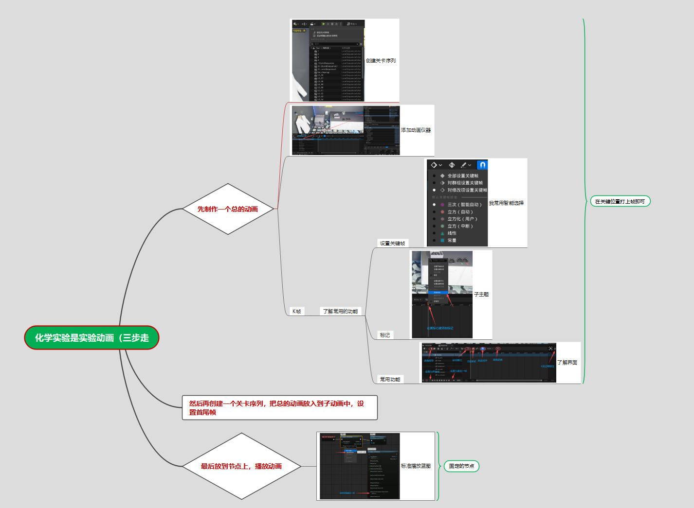
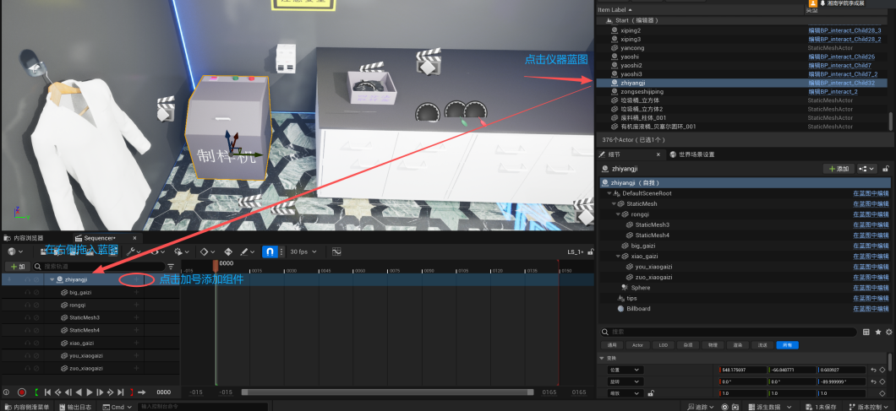
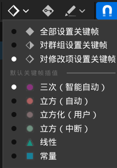
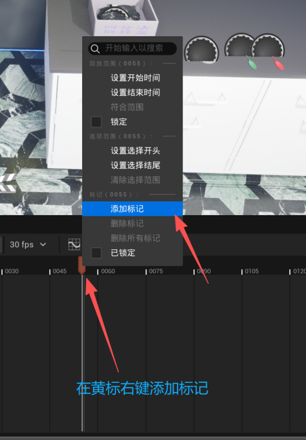
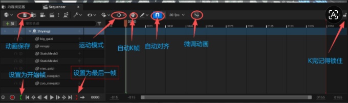

# 关卡序列动画

> Level Sequence · Sequencer · 实验步骤动画。

## 思维导图

化学实验动画的完整思路，点击放大：



---

制作动画分三步走：**先制作一个总的动画 → 放到子序列上剪切 → 播放**。

## 1. 创建关卡序列

内容浏览器右键 → 动画 → **关卡序列**，起名（LS_）。双击打开 Sequencer 编辑器。

## 2. 添加动画仪器

把场景里要动的仪器拖到 Sequencer 轨道里，自动创建 Transform 轨道。


## 3. K 帧

把时间指针拖到目标位置 → 场景里移动/旋转仪器 → **回车**打关键帧。

### 了解常用的功能

#### 设置关键帧



#### 标记



#### 常用功能

熟知以下功能可以提高效率：


## 轴心设置

K 帧前先确认轴心对不对——仪器绕着轴心转，不是物体中心。

选中仪器 → 按 `Ctrl+E` → 调轴心位置。

比如试管倒液体，轴心得在试管口。

## 子序列

先做总的**主序列**，然后把其他关卡序列**拖进去当子序列**，设置首尾帧即可。

```
主序列
├── 子序列：取试剂
├── 子序列：加热
└── 子序列：观察现象
```

改细节进子序列改，不影响主序列。
