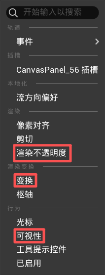
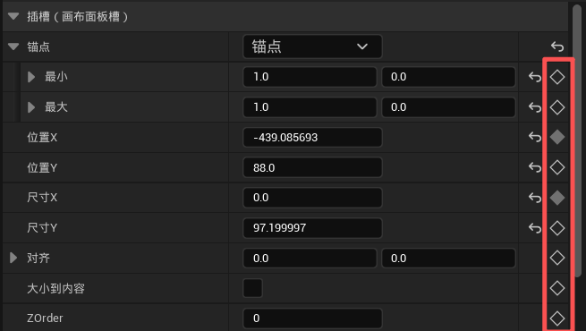

# UI 动画

> Widget Animation · 控件动效 · 入场退场。

## 和关卡序列一样的道理

Widget 动画和[关卡序列](../animation/level-sequence.md)本质上一回事——**打关键帧，中间自动过渡**。

区别只在于：关卡序列控制的是场景里的 Actor，Widget 动画控制的是 UI 控件。

## 常用轨道

打开任意 Widget Blueprint → 左下角 **动画** 面板 → 新建动画 → 在时间轴上给控件添加轨道：

| 轨道 | 效果 | 什么时候用 |
|------|------|-----------|
| **变换** | 位移、缩放、旋转 | 面板滑入滑出、按钮弹跳 |
| **可视性** | 显示/隐藏 | 控件突然出现或消失 |
| **渲染不透明度** | 0（全透）↔ 1（不透） | 渐入渐出 |



> 渐入：0s 时渲染不透明度 = 0 → 0.3s 时渲染不透明度 = 1
> 渐出反过来即可。

## 进阶：在细节面板直接加关键帧

除了轨道列表，还可以选中控件 → 右侧**细节面板** → 在**插槽**属性旁边点 `+` 号直接加关键帧：



这种方式更灵活——你看到哪个属性想动，就在它旁边点一下。位置、大小、间距、颜色……几乎任何属性都能打关键帧。

## 案例参考

项目的 `WBP_TaskPanel2` 里有一段典型的 UI 动画，路径：

```
Content/main_UI/RenWu_UI/WBP_TaskPanel2.uasset
```

打开这个文件 → 左下角动画面板，可以看到实际项目里是怎么用的。

---

## 本页导航

- [常用轨道](#常用轨道)
- [细节面板加关键帧](#进阶在细节面板直接加关键帧)
- [案例参考](#案例参考)

---

## 蓝图调用动画

```blueprint
// 播放
PlayAnimation(动画名)

// 反向播放（退场）
PlayAnimationReverse(动画名)

// 播完做下一步
PlayAnimation(动画名) → OnAnimationFinished → 打开面板 / 切换页面
```

## 缓动

在时间轴上选中关键帧 → 右键 → **缓动**，选一个曲线：

| 缓动 | 感觉 |
|------|------|
| Linear | 匀速 |
| Cubic Out | 快→慢，常用 |
| Cubic In | 慢→快 |
| Elastic Out | 弹一下停住 |

> 一般面板滑入选 **Cubic Out**，不会显得突兀。
