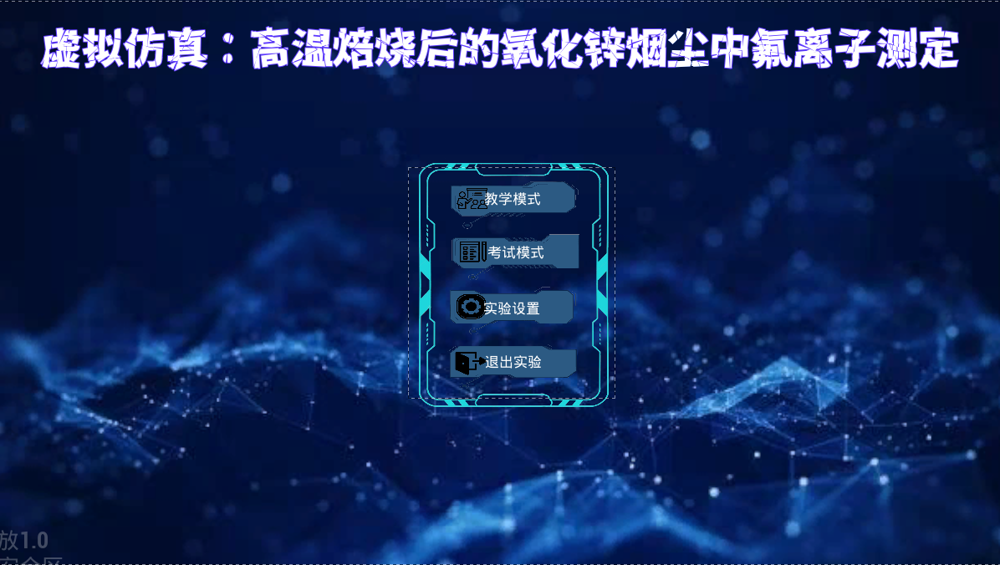

# Widget UI 系统

> UMG · Widget Blueprint · 界面构建。

## 本页导航

- [案例 1：主菜单](#案例-1主菜单--设置界面)
  - [画布](#画布) · [多格式文本/文本](#多格式文本文本) · [按钮](#按钮) · [控件切换器](#控件切换器) · [水平框/垂直框](#水平框--垂直框)
- [案例 1 延伸：设置界面](#案例-1-延伸设置界面)
  - [尺寸框](#尺寸框) · [覆层](#覆层) · [组合框](#组合框) · [勾选框](#勾选框) · [滑条](#滑条)
- [Widget 通用工作流](#widget-通用工作流)
- [B站视频](#b站视频索引)

---

## 控件速查表

> ★★★ = 必记，每个界面都要用 &emsp; ★★☆ = 常用 &emsp; ★☆☆ = 需要时查文档

### 布局容器

| 控件 | 重要度 | 一句话 | 第一眼要看 |
|------|--------|--------|------------|
| **画布** | ★★★ | 绝对定位，控件拖到哪里就在哪里 | 锚点 |
| **垂直框** | ★★★ | 从上到下自动排列 |  |
| **水平框** | ★★★ | 从左到右自动排列 |  |
| **覆层** | ★★☆ | 层叠，后面的覆盖前面的 |  |
| **尺寸框** | ★★☆ | 限制内部控件的最大/最小尺寸 | 最大宽高 |
| **滚动框** | ★★☆ | 内容超出则出现滚动条 | 滚动条样式 |

### 显示控件

| 控件 | 重要度 | 一句话 | 第一眼要看 |
|------|--------|--------|------------|
| **文本** | ★★★ | 显示文字 | 字体 |
| **多格式文本** | ★★☆ | 支持不同颜色/大小的文字混排 | 文本样式集 |
| **图片** | ★★★ | 显示图片/材质 | 笔刷贴图 |
| **进度条** | ★★☆ | 进度条 | 百分比 |

### 交互控件

| 控件 | 重要度 | 一句话 | 第一眼要看 |
|------|--------|--------|------------|
| **按钮** | ★★★ | 点击触发事件 | 点击事件 |
| **勾选框** | ★★☆ | 勾选框（开/关） | 状态变化事件 |
| **滑条** | ★★☆ | 滑动条（数值区间） | 最小最大值 |
| **组合框** | ★★☆ | 下拉选择 | 选项列表 |
| **可编辑文本** | ★★☆ | 用户输入文字 | 输入完成事件 |
| **控件切换器** | ★★☆ | 多个页面之间切换 | 激活页索引 |

---

## 案例 1：主菜单 & 设置界面

> *用你项目里实际的主菜单 UI 做例子。打开你的主菜单 Widget Blueprint，对照着看。*

### 界面分层结构（用覆层 + 画布）

```
主菜单 Widget
└── 画布                             ← 整个界面的画布
    ├── 图片（背景图）                 ← 全屏拉伸
    ├── 覆层                          ← 中间菜单区，分层
    │   ├── 图片（菜单底框）            ← 半透明黑底
    │   ├── 垂直框                     ← 按钮纵向排列
    │   │   ├── 按钮（开始实验）        ← 大小 300×60
    │   │   ├── 按钮（实验列表）
    │   │   ├── 按钮（设置）
    │   │   └── 按钮（退出）
    │   └── 多格式文本（标题）          ← 上方浮动，"化学实验平台"
    └── 文本（版本号）                  ← 右下角，v1.0
```


### 逐个控件拆解

#### 画布

> ★★★ 每个 Widget 的根容器几乎都是它。

可以类比成**画画用的画布**

---

#### 多格式文本/文本

> ★★★ 显示所有不可编辑的文字。

- **和普通文本的区别**：一句话里不同字可以不同颜色、不同大小。
- **多格式文本怎么用**：

  1. 内容浏览器右键 → 杂项 → 数据表 → 行结构选 `RichTextStyleRow`
  2. 点添加，建两个样式：`Title`（金色大字）、`Normal`（白色小字）
  3. 设计器里选中多格式文本 → 细节 → 外观 → 文本样式集 → 选刚建的数据表
  4. Text 里写：`<Title>化学实验平台</>欢迎来到<Normal>主菜单</>`

---

#### 按钮

> ★★★ 所有可点击的东西。

- **关键事件**：`OnClicked` —— 点击后执行逻辑
- **案例中怎么用**：
  - "开始实验" → OnClicked → OpenLevel(实验关卡)
  - "设置" → OnClicked → 控件切换器切到设置页

---

#### 控件切换器

> ★★☆ 一个容器里放多个页面，但**一次只显示一个**。

可以类比成手机上**左右滑动的标签页**——主页、设置页、资料页，每次只看一页。

- **在 Designer 里怎么设**：
  拖进来后，往它下面塞子控件，每个子控件就是一个"页"。第一个子控件 = 第 0 页，第二个 = 第 1 页，以此类推。右侧细节面板的 **Active Widget Index** 控制默认显示第几页。

- **在蓝图里怎么切**：
  `控件切换器 → SetActiveWidgetIndex(页码)`
  - 切到第 0 页：`SetActiveWidgetIndex(0)`
  - 切到第 1 页：`SetActiveWidgetIndex(1)`

- **典型场景**：

  | 场景 | 第 0 页 | 第 1 页 |
  |------|---------|---------|
  | 主菜单 ↔ 设置 | 主菜单按钮 | 设置面板 |
  | 密码显示/隐藏 | 密码明文 | `******` |

  ```
  密码框 Widget
  └── 控件切换器
      ├── [0] 图片（眼睛睁开图标）    ← 点一下切到第 1 页
      └── [1] 图片（眼睛闭上图标）    ← 点一下切到第 0 页
  ```

  > 密码切换的蓝图：按钮 OnClicked → 控件切换器.SetActiveWidgetIndex(1)
  > 再点一次 → SetActiveWidgetIndex(0)

---

#### 水平框 / 垂直框

> ★★★ 自动排列子控件，不需要手动算坐标。

- **作用**：
  - 垂直框：子控件从上到下一个接一个
  - 水平框：子控件从左到右一个接一个
- **关键属性**：
  - 每个子项的 **Padding** —— 外边距
  - 每个子项的 **Size** —— Fill（撑满剩余空间）/ Auto（内容多大就多大）
- **案例中怎么用**：
  - 垂直框排列 4 个主菜单按钮，间距统一用 Padding 控制
  - 水平框排列音量滑条 + 数值标签

---

## 案例 1 延伸：设置界面

设置界面可以在一个 **控件切换器** 里，作为主菜单的第二个页面。这个控件切换比较典型的用法是输入密码的显示或隐藏的UI切换

```
设置页面
└── 垂直框
    ├── 尺寸框（限宽 400）
    │   └── 组合框（分辨率选择）
    │       Options: ["1920×1080", "2560×1440", "3840×2160"]
    ├── 勾选框（全屏 / 窗口）
    ├── 水平框
    │   ├── 文本（音量）
    │   └── 滑条（0.0 ~ 1.0）
    └── 按钮（返回主菜单）
```

### 设置界面用到的额外控件

#### 尺寸框

- **作用**：给内部控件一个**最大/最小宽度和高度**，它不会超过这个限制
- **案例中怎么用**：下拉框不加 Size Box 会拉满整行，加 `MaxWidth=400` 限制宽度

#### 覆层

- **作用**：和 Photoshop "图层" 概念一样。后添加的控件叠在上面
- **案例中怎么用**：主菜单背景图 + 半透明遮罩 + 菜单按钮，三层叠加

#### 组合框

- **作用**：从预定义列表中选一项
- **关键**：在细节 → 选项里添加选项，`OnSelectionChanged` 事件获取选中值
- **案例中怎么用**：分辨率选择

#### 勾选框

- **作用**：开/关切换
- **关键**：`OnCheckStateChanged(IsChecked)` → Boolean 判断
- **案例中怎么用**：全屏开关

#### 滑条

- **作用**：在 Min（0.0）~ Max（1.0）之间取值
- **关键**：`OnValueChanged(Value)` → 获取当前值
- **案例中怎么用**：音量控制

---

## Widget 通用工作流

<!-- TODO: 以下内容在你写完控件案例后补充 -->

### 创建 → 显示 → 销毁

```blueprint
// 创建 Widget
Create Widget → Add to Viewport

// 切换页面（主菜单 ← → 设置）
控件切换器.SetActiveWidgetIndex(1)

// 销毁
Remove from Parent
```

### 分辨率适配

- **锚点 (Anchors)**：背景图锚点拉满四角；按钮锚点居中
- **尺寸框**：给下拉框、输入框加最大宽度
- **DPI 缩放**：项目设置->引擎->用户界面

---

## B站视频索引

> 找视频辅助学更快：

https://www.bilibili.com/video/BV1XN4y117GM/?spm_id_from=333.1007.top_right_bar_window_history.content.click&vd_source=b8f35d6b8b01aaa29ccd685ef5fd7b18
<!--
TODO:
  1. 打开主菜单 Widget，截一张 Designer 界面的图放到 docs/images/ 下
-->
